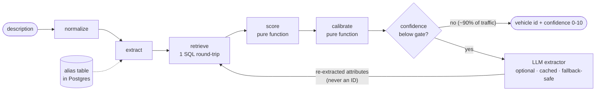

# Vehicle Matcher

[](https://github.com/IbramGhali/Vehicle-matcher/actions/workflows/ci.yml)
[](https://github.com/IbramGhali/Vehicle-matcher/actions/workflows/nightly.yml)


Matches free-text marketplace car descriptions to a vehicle in a PostgreSQL
catalogue, with a calibrated 0–10 confidence score — including confident
*absence* ("Ford Ranger" → `null` at confidence 10).

```
Input: VW Amarok Ultimate
Vehicle ID: 4951649860714496
Confidence: 7
```

### At a glance

| | |
|---|---|
| **Accuracy** | 4/4 challenge anchors exact · 21/21 labeled eval set · MRR 1.000 |
| **Latency** | p50 **7.8 ms** / p95 **41.8 ms** at 10k vehicles / 100k listings |
| **Cost** | deterministic path ≈ $0 · LLM only below the confidence gate |
| **Verification** | 148 tests, 5 layers · 93% coverage · nightly mutation + perf gates |
| **Operability** | versioned decisions · JSON match log · shadow audit |

**Contents** · [Quickstart](#quickstart) · [How it works](#how-it-works) ·
[Design decisions](#design-decisions) · [Accuracy](#accuracy) ·
[Scale](#scale-10k-vehicles--100k-listings) · [Cost](#cost) ·
[Evaluation](#evaluation) · [Testing](#testing) ·
[Layout](#repository-layout) · [Operating notes](#operating-notes) ·
[Roadmap](#limitations--roadmap) · [Tuning log](#tuning-log) ·
[Alternatives](#alternatives-considered)

---

## Quickstart

```bash
docker compose up -d --wait          # postgres:16 on localhost:5433
make setup                           # venv + install (or: pip install -e ".[dev]")
python scripts/setup_db.py           # load data/data.sql + migrations, verify counts
python -m vehicle_matcher.cli data/inputs.txt          # the 20 challenge inputs
python -m vehicle_matcher.cli data/inputs.txt --debug  # + score table per input
make test                            # full suite
```

All challenge data ships in `data/`. Config is env-based (`.env.example`).
Full run output: [docs/final-run.txt](docs/final-run.txt). Interactive demo:
`python scripts/demo_server.py` → http://localhost:8765.

## How it works



- **normalize** — lowercase, strip punctuation (keeping `h/line`, `r-line`), tokenize.
- **extract** — discourse rules first ("it's actually a…" corrections,
  "in exchange for…" distractors, engine-swap donors), then a longest-match
  scan over the vocabulary: catalogue makes/models, aliases (`vw`, `4x4`,
  `h/line`), engine-code regexes. Unstated attributes stay `None` — never guessed.
- **retrieve** — one round-trip; recall arms chosen by what was extracted
  (exact/trigram model, all-of-make, per-token strict word similarity), all
  trigram-GIN indexed. Retrieval owes recall; precision is the scorer's job.
- **score** — per attribute: match, conflict, or unstated. Conflicts hurt far
  more than silence; badge penalties are asymmetric; weak signals (TSI→Petrol)
  never conflict; an `ln(1+listings)` prior implements the tie-break rule.
- **calibrate** — specificity + margin − conflicts − reinterpretation risk.
  Null results get their own scale: recognised-but-absent → high confidence,
  uninterpretable text → low.

Three principles hold everywhere:

1. **The LLM never picks a vehicle ID** — it only re-extracts attributes when
   rules are unsure (off by default, cached, degrades to rules on failure).
2. **Push down what benefits from indexes; pull up what benefits from tests** —
   retrieval in SQL, scoring/calibration as pure functions at ~100% coverage.
3. **Vocabulary is data** — growing coverage is an INSERT, not a release.

## Design decisions

| decision | rationale |
|---|---|
| **`data.sql` repair in the loader** | Vendor file creates `listing.it` but INSERTs into `id` — cannot run as-is. Loader renames the column between DDL and insert; the file is never edited (CI pins its sha256). |
| **External reference vocabulary** | Common AU makes/models *not* in the catalogue live in the alias table. That turns "Ford Ranger" from unrecognised text into provable absence (null@10). |
| **`strict_word_similarity`** | Plain word similarity matches partial words ("cab" → 0.5 vs "**ca**mry") and floods the pool. Strict keeps "amrok"→"amarok" recall without the noise. Found by a failing test, kept as a regression test. |
| **Fuzzy badge floor 0.85** | Adjacent trim codes score exactly 0.8 ("gt"/"gts") and are different vehicles, not typos. |
| **Generated `search_text` + GIN** | Computed at write, can't drift; GIN for a read-dominated load. Seq-scan at 59 rows is correct — the indexes are for 10k+, [proven](docs/scale-evidence.txt). |
| **Listing counts as a materialized view** | Popularity is a prior; staleness is fine. Refreshed out of band, never per request. |
| **Two confidence semantics** | Match-confidence and null-confidence are different questions — separate calibration branches. |

## Accuracy

All four challenge anchors reproduce exactly (`tests/golden/`):

| input | result |
|---|---|
| Volkswagen Golf 110TSI Comfortline Petrol Automatic FWD | `4749339721203712` @ **9** |
| VW Amarok Ultimate | `4951649860714496` @ **7** |
| VW Golf R with engine swap from Toyota 86 GT | `5824662093168640` @ **6** |
| Ford Ranger XLT Dual Cab | `null` @ **10** |

The other 16 inputs are snapshot-locked — any behaviour change is a visible
diff. Hard cases behave: the Kluger→86 GT correction resolves with the tie
broken by listings; "Amrok h/line 4x4" reaches Amarok TDI550 Highline via
fuzzy retrieval; "Toyota Corolla" is a confident null despite well-scoring
Camry look-alikes. Ambiguous inputs ("Toyota Camry Hybrid" — three hybrids)
answer at modest confidence: calibrated uncertainty, not a miss.

## Scale (10k+ vehicles / 100k+ listings)

`scripts/synth_scale.py` runs the real matcher over a synthetic
10k/100k catalogue, 1,000 mixed queries ([evidence](docs/scale-evidence.txt)):

| metric | value |
|---|---|
| p50 / p95 / max | **7.8 ms / 41.8 ms / 150 ms** |
| matched | 949/1000 (misses = garbled styles → low-confidence nulls) |
| model arm | BitmapOr over btree + trigram GIN, 0.55 ms |
| token arm | Bitmap Index Scan on `search_text` GIN, 4.9 ms |

The p95 tail is the make-only arm; the production fix is an in-process
catalogue cache (~1–2 MB at 10k vehicles) — see roadmap.

## Cost

Rules path ≈ $0. With the LLM tier on, only sub-gate descriptions escalate
(2/20 here; ~5–15% on real traffic), responses are cached by content hash,
and a Haiku-class model (~$0.0014/call) blends to **$0.0001–0.0002 per
description**. The gate is the accuracy–cost dial.

## Evaluation

`scripts/evaluate.py` scores a labeled set (21 cases, multiple acceptable IDs
where genuinely ambiguous):

```
top-1 accuracy:   100.0%      null precision:  100.0%
match precision:  100.0%      null recall:     100.0%
match recall:     100.0%      MRR:             1.000
reliability: low 0-4 -> 100% · mid 5-7 -> 100% · high 8-10 -> 100%
```

The same scorecard runs in the test suite as a hard gate (accuracy floor,
perfect absence detection, monotone calibration). Growing the CSV with
labeled production samples is the intended feedback loop.

## Testing

148 tests, five layers:

| layer | proves |
|---|---|
| **unit** (no DB) | normalizer, discourse rules, scorer semantics, calibrator branches, LLM contract (stub client) |
| **property** | no exceptions on arbitrary unicode; confidence ∈ [0,10]; determinism |
| **integration** (real PG) | load idempotency, `it→id` repair, index existence, **recall invariant**, injection safety, **fault injection** (dead DB raises, never fakes a null), thread consistency, destructive loader paths on a scratch DB |
| **golden** | 4 anchors exact; semantic expectation per input; run snapshot; CLI format; LLM routing; eval scorecard as gate; recorded real API response replayed offline |
| **robustness** | hostile input (emoji, 10k-char tokens, SQL-shaped text), permutation/case invariance, end-to-end confidence monotonicity, DB unchanged after hostile batch |

**CI**: lint → strict mypy → data checksum → suite + coverage gate → smoke run.
**Nightly**: mutation testing on the scoring core (report-only) + the 10k
benchmark under a hard p95 budget.

## Repository layout

```
vehicle-matcher/
├── data/                  # challenge files, byte-identical (CI-checksummed)
├── migrations/            # search infrastructure + vocabulary seed
├── scripts/               # loader, scale benchmark, eval, shadow audit, demo UI
├── src/vehicle_matcher/   # normalizer → extractor → retrieval → scorer → calibrator
├── tests/                 # unit / integration / golden / robustness
└── docs/                  # final-run.txt, scale-evidence.txt
```

## Operating notes

Stateless library: one `Matcher` per process (DB connection + cached
vocabulary). For pipelines: wrap in a queue consumer or HTTP service with
`psycopg_pool`; MV refresh stays out of band.

- **Match log** — one JSON event per match (`--log` on the CLI): input hash —
  never the raw text — extraction, scores, margin, tier, version, duration.
  Drift alarm (low-confidence rate), cost alarm (escalation rate), and latency
  percentiles all derive from this stream.
- **Decision provenance** — every result carries `matcher_version` (package
  version + fingerprint of weights, vocabulary, thresholds). Retunes never
  orphan historical decisions.
- **Shadow audit** — the gate only re-examines *low*-confidence results;
  `scripts/shadow_audit.py` samples high-confidence matches, re-extracts via
  the LLM, and reports disagreements. Its first run caught a real defect
  (LLM output bypassing vocabulary canonicalization — fixed, test-pinned) and
  showed the scorer absorbing an LLM hallucination without changing the
  answer.

## Limitations & roadmap

1. **Learned scorer + statistical calibration** — hand weights and heuristic
   confidence replaced by a GBDT ranker + isotonic mapping once labels exist;
   the current scorer becomes its feature vector.
2. **In-process catalogue cache** — kills the make-arm tail and per-call
   round-trip; Postgres stays source of truth.
3. **Alias mining** — the match log's unknown-token stream is the ranked
   backlog; needs curation tooling at 10k vehicles.
4. **Scheduled shadow audit** — run continuously on sampled traffic, alert on
   disagreement rate.

Deliberately **not** built: ORM, API service, vector DB, Elasticsearch,
fine-tuning — each contradicts cost discipline at this catalogue size.

## Tuning log

- Calibrator margins and the unstated-attributes penalty set against the four
  anchors only; the other 16 inputs are snapshot-locked, not targets.
- `badge_fuzzy_floor` 0.8 → 0.85 after GT/GTS cross-crediting.
- Token arm switched to strict word similarity after "Ford Ranger XLT Dual
  Cab" retrieved Camry candidates.

## Alternatives considered

| approach | pros | cons / limitation | verdict |
|---|---|---|---|
| **Pure rules/regex** | free, fast, explainable | silent decay; every new phrasing is a code change | kept as the spine; vocabulary moved to data; LLM gate covers the rest |
| **LLM matches end-to-end** | best comprehension of messy text [2] | cost + latency per call; non-deterministic; self-reported confidence; hallucinated IDs; catalogue outgrows the prompt | reduced to extraction-only |
| **Fine-tuned transformer matcher** | SOTA on matching benchmarks | thousands of labels, GPU serving, retraining per catalogue | premature with 20 labels |
| **Embeddings / vector similarity** | typo/paraphrase robust | blind to GT/GTS distinctions; uncalibrated; weak absence detection | rejected as matcher; roadmap recall backstop |
| **Elasticsearch/OpenSearch** | mature relevance tooling | second stateful system for a problem pg_trgm solves in single-digit ms (measured) | rejected on operational cost |
| **Learned scorer (Fellegi-Sunter [1] / GBDT)** | strongest long-term accuracy; measurable confidence | needs labels that don't exist on day one | sequenced: current scorer becomes its feature vector |

Each rejected option fails one of the brief's axes (accuracy, cost, latency)
or operability; the hybrid spends money only where the text is genuinely hard.

**References**

1. Fellegi & Sunter — *A Theory for Record Linkage*, JASA 64(328), 1969.
   The per-attribute-evidence model this scorer approximates.
2. Peeters & Bizer — *Entity Matching using Large Language Models*,
   [arXiv:2310.11244](https://arxiv.org/abs/2310.11244), 2023. Why the LLM
   earns a place — and why only behind a gate.

---

*AI assistance disclosure: Claude (Anthropic) was used as a development
assistant — README formatting, parts of the test suite, and code formatting
passes. Architecture and design decisions are my own; all code, generated or
not, passes the same review, test, and CI gates.*
